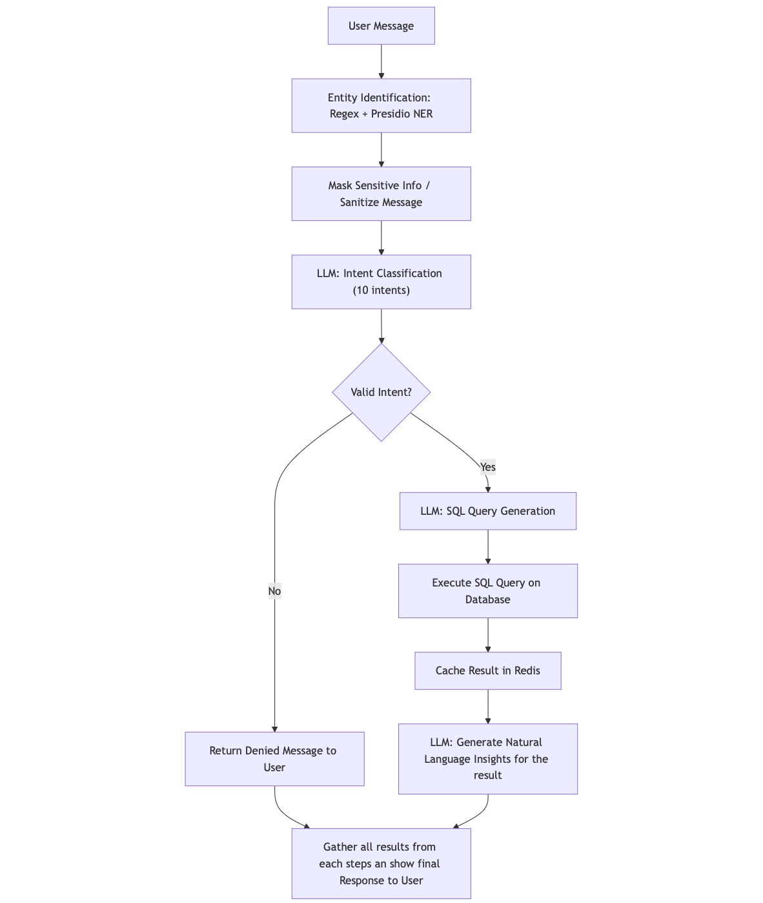

# JunctionX OuluES Hackathon Project

## What is this repo?

This repository is for the JunctionX OuluES hackathon competition.

## Problem Statement

**Challenge:** Build an LLM-based agentic system that can answer natural-language queries on sensitive datasets without exposing private information.

## Our Idea

We propose building an agentic system to help hospital staff work with patient data safely and efficiently, ensuring sensitive information is protected at all times.

## Tech Stack

- **FastAPI**: Hosts APIs for various backend functions.
- **OpenAI Service**: Provides LLM (Large Language Model) capabilities for natural language understanding and generation.
- **presidio-analyzer library**: Uses Named Entity Recognition (NER) and REGEX to detect sensitive components in user messages.
- **n8n**: Automation workflow tool to integrate and orchestrate multiple steps in the process.
- **Docker**: Bundles all components into a runnable application for easy deployment.
- **git-hub**: Source control and collaboration.
- **Next-js**: Front-end framework for building the user interface.

## Further Improvements

- Add chat history to the agent for better context and usability.
- Handle out-of-domain questions to improve robustness and user experience.

## System Flowchart

